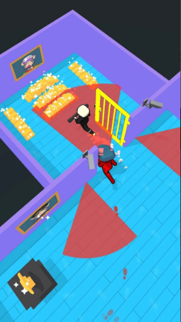

# Unity Mobile 3D Game - Thief Master  

Gra 3D, która została opracowana przy współpracy z wydawcą ,,Mooniee'' oraz umieszczona w sklepie **Google Play**. Podczas tworzenia gry konsultowaliśmy koncepcję oraz kolejne kroki postępu z zespołem przydzielonym przez wydawcę.  

Poniższe linki prowadzą prosto do sklepu Google Play gdzie dostępne są również postałe nasze produkcje do pobrania zupełnie za darmo :) 

[Link do strony z naszymi grami (GeekBox) - Google Play](https://play.google.com/store/apps/dev?id=6893354586300001935)  
[Link do strony z naszymi grami (CyberSkyGames) - Google Play](https://play.google.com/store/apps/dev?id=6955278336175220384)  

[**Link do pobrania gry - Google Play**](https://play.google.com/store/apps/details?id=com.thief.money.master&hl=pl)

## O grze

Główne funkcjonalności w grze:

- Mechanika stakowania, która aktualnie była popularna na sklepie play.
- ,,Hide and Seek''.
- Interakcja z elementami otocznia.
- Dynamiczne pole widzenia strażników.
 

### Technologie

Przy tworzeniu gry zostały wykorzystane następujące technologie:

- Unity - Silnik gry, na którym została w całości stworzona.
- C#    - Język programowania użyty do napisania logiki gry.
- Odin Inspector
- Sirenix Serializer
- DoTween
- More Performance Coroutines
- Easy Mobile Pro
